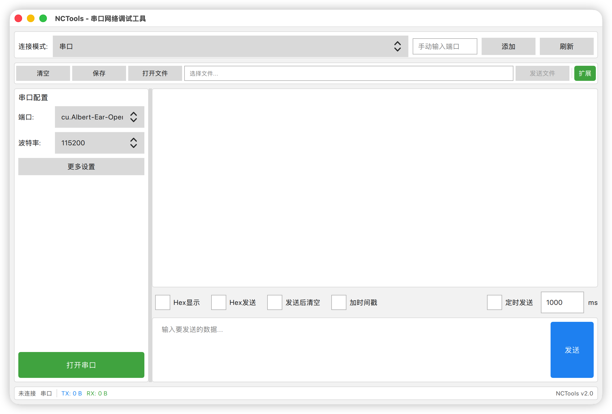

# NCTools - 串口网络调试工具

<div align="center">


**一款跨平台的串口网络调试工具，支持串口、TCP Server、TCP Client、UDP 通信**

[](https://www.gnu.org/licenses/gpl-3.0)
[](https://www.qt.io)
[](https://www.qt.io)

</div>

**中文** | [English](README_EN.md)

## 📖 简介

NCTools 是一款功能强大的串口网络调试工具，专为嵌入式开发、设备调试和通信测试而设计。软件采用现代化的 QML 界面，支持多种通信方式，提供直观的数据收发和分析功能。

本项目使用 [MiMoCode](https://github.com/anthropics/claude-code) 进行代码重构，采用模块化架构设计，实现了界面与逻辑的完全分离。



## ✨ 功能特性

### 🔌 多种通信方式

| 通信方式 | 功能说明 |
|---------|---------|
| **串口通信** | 支持系统串口检测、手动添加端口、可配置波特率/数据位/停止位/校验位/流控制 |
| **TCP Server** | 监听指定端口，支持多客户端连接，数据广播发送 |
| **TCP Client** | 连接远程 TCP 服务器，支持断线提示 |
| **UDP** | 绑定本地端口接收数据，支持向指定 IP/端口发送数据报 |

### 📊 数据处理

- **Hex 显示/发送**：支持十六进制和 ASCII 码两种数据格式
- **时间戳**：可选为收发数据添加精确到毫秒的时间戳
- **自动发送**：支持定时自动发送，可配置发送间隔
- **文件发送**：支持发送文件内容，带进度条显示
- **数据保存**：可将接收区数据导出为文本文件

### 🚀 快速发送

- 20 行快速发送面板
- 每行支持独立的 Hex 模式切换
- 发送内容自动保存，下次启动时恢复

### 📈 实时统计

- 状态栏显示 TX（发送）/ RX（接收）字节统计
- 支持 B/KB/MB 自动格式化显示
- 切换连接类型或清空时自动重置统计

### 🌍 多语言支持

- 支持中文/英文界面切换
- 菜单栏一键切换语言

## 🖥️ 系统要求

- **操作系统**：Windows 10+ 或 macOS 12.0+
- **Qt 版本**：Qt 6.8.3
- **编译器**：
  - Windows: MSVC 2019+ 或 MinGW 12+
  - macOS: Xcode Command Line Tools (Apple Clang)
- **构建工具**：CMake 3.19+

## 📦 安装与构建

### 从源码构建

```bash
# 克隆仓库
git clone https://github.com/zuozl1992/NCTools.git
cd NCTools

# 创建构建目录
mkdir build && cd build
```

#### macOS

```bash
# 配置 CMake（指定 Qt 安装路径）
cmake .. -DCMAKE_PREFIX_PATH=~/Qt/6.8.3/macos

# 编译
cmake --build .

# 运行
./src/app/NCTools.app/Contents/MacOS/NCTools
```

#### Windows

```cmd
# 配置 CMake（指定 Qt 安装路径）
cmake .. -DCMAKE_PREFIX_PATH=C:/Qt/6.8.3/msvc2019_64

# 编译
cmake --build . --config Release

# 运行
.\src\app\Release\NCTools.exe
```

### 安装 Qt

1. 从 [Qt 官网](https://www.qt.io/download) 下载 Qt Online Installer
2. 安装 Qt 6.8.3，勾选以下组件：
   - Qt 6.8.3 for macOS
   - Qt SerialPort
   - Qt Network

## 🏗️ 项目结构

```
NCTools/
├── CMakeLists.txt                    # 顶层构建文件
├── cmake/                            # CMake 辅助脚本
│   └── QtVersionCheck.cmake
├── src/
│   ├── core/                         # 核心逻辑层（无 UI 依赖）
│   │   ├── transport/                # 通信传输层
│   │   │   ├── abstracttransport.h   # 抽象传输接口
│   │   │   ├── serialtransport.*     # 串口通信
│   │   │   ├── tcpservertransport.*  # TCP 服务器
│   │   │   ├── tcpclienttransport.*  # TCP 客户端
│   │   │   ├── udptransport.*        # UDP 通信
│   │   │   ├── transportfactory.*    # 通信工厂
│   │   │   └── transportconfig.h     # 通信配置
│   │   ├── dataprocessor/            # 数据处理器
│   │   ├── settings/                 # 设置管理器
│   │   └── language/                 # 语言管理器
│   ├── bridge/                       # 桥接层（C++ ↔ QML）
│   │   ├── appcontroller.*           # 应用控制器
│   │   ├── transportcontroller.*     # 通信控制器
│   │   └── quicksendmodel.*          # 快速发送模型
│   ├── app/                          # 应用入口
│   │   ├── main.cpp
│   │   └── *.qml                     # QML 界面文件
│   └── qml/                          # QML 源文件备份
├── tests/                            # 单元测试
├── resources/                        # 资源文件
└── .mimocode/                        # MiMoCode 配置
```

## 🎯 使用指南

### 串口通信

1. 将串口设备连接到 Mac
2. 在顶部下拉框选择串口（或手动输入端口名）
3. 配置波特率等参数
4. 点击"打开串口"
5. 在发送区输入数据，点击"发送"

### TCP Server

1. 选择 "TCP Server" 模式
2. 输入监听端口
3. 点击"启动服务器"
4. 等待客户端连接
5. 发送数据会广播到所有已连接客户端

### TCP Client

1. 选择 "TCP Client" 模式
2. 输入服务器 IP 和端口
3. 点击"连接服务器"
4. 连接成功后即可收发数据

### UDP

1. 选择 "UDP" 模式
2. 输入本地端口（用于接收）
3. 输入远程 IP 和端口（用于发送）
4. 点击"绑定"开始接收
5. 发送数据无需绑定，只需填写远程地址

### Hex 模式

- **Hex 显示**：勾选后，接收数据以十六进制格式显示
- **Hex 发送**：勾选后，发送区输入十六进制数据（如 `48 65 6C 6C 6F`）

### 快速发送

1. 点击工具栏"扩展"按钮
2. 在弹出的快速发送面板中输入数据
3. 可为每行单独设置 Hex 模式
4. 点击每行的"发送"按钮快速发送

## 🧪 运行测试

```bash
cd build
./tests/test_dataprocessor
./tests/test_settingsmanager
./tests/test_transportfactory
```

## 📝 开发说明

### 架构设计

项目采用三层架构：

```
┌─────────────────────────────────┐
│         QML UI 层               │
├─────────────────────────────────┤
│       Bridge 桥接层              │
├─────────────────────────────────┤
│        Core 核心层               │
└─────────────────────────────────┘
```

- **Core 层**：纯 C++ 逻辑，无 UI 依赖，可独立测试
- **Bridge 层**：QObject 派生类，暴露 C++ 接口给 QML
- **UI 层**：QML 界面，通过桥接层访问后端功能

### 通信抽象

所有通信类型实现统一的 `AbstractTransport` 接口：

```cpp
class AbstractTransport : public QObject {
    virtual bool open() = 0;
    virtual void close() = 0;
    virtual bool isConnected() const = 0;
    virtual bool sendData(const QByteArray &data) = 0;
};
```

通过 `TransportFactory` 创建具体的通信对象，实现通信类型的灵活切换。

## 🤝 贡献

欢迎提交 Issue 和 Pull Request！

1. Fork 本仓库
2. 创建特性分支 (`git checkout -b feature/AmazingFeature`)
3. 提交更改 (`git commit -m 'Add some AmazingFeature'`)
4. 推送到分支 (`git push origin feature/AmazingFeature`)
5. 创建 Pull Request

## 📄 许可证

本项目采用 [GNU General Public License v3.0](https://www.gnu.org/licenses/gpl-3.0) 许可证。

```
Copyright (C) 2024 NCTools

This program is free software: you can redistribute it and/or modify
it under the terms of the GNU General Public License as published by
the Free Software Foundation, either version 3 of the License, or
(at your option) any later version.

This program is distributed in the hope that it will be useful,
but WITHOUT ANY WARRANTY; without even the implied warranty of
MERCHANTABILITY or FITNESS FOR A PARTICULAR PURPOSE.  See the
GNU General Public License for more details.

You should have received a copy of the GNU General Public License
along with this program.  If not, see <https://www.gnu.org/licenses/>.
```

## 🙏 致谢

- [Qt](https://www.qt.io/) - 跨平台应用框架
- [MiMoCode](https://github.com/anthropics/claude-code) - AI 辅助代码重构工具

## 📧 联系方式

如有问题或建议，请通过以下方式联系：

- 提交 [Issue](https://github.com/zuozl1992/mysscom/issues)

---

<div align="center">

**⭐ 如果这个项目对你有帮助，请给个 Star 支持一下！ ⭐**

</div>
