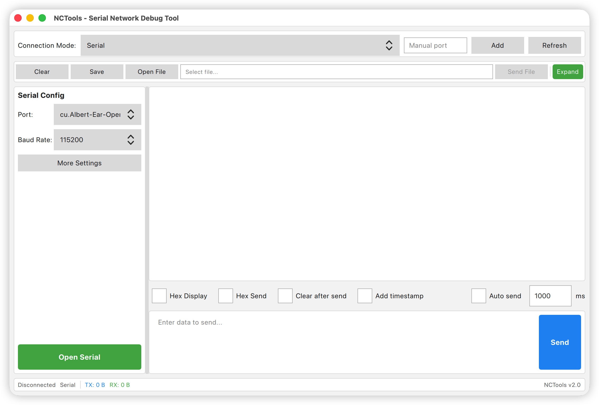

# NCTools - Serial Network Debugging Tool

<div align="center">


**A cross-platform serial network debugging tool supporting Serial, TCP Server, TCP Client, and UDP communication**

[](https://www.gnu.org/licenses/gpl-3.0)
[](https://www.qt.io)
[](https://www.apple.com/macos/)

</div>

[中文版本](README.md) | **English**

## 📖 Introduction

NCTools is a powerful serial network debugging tool designed for embedded development, device debugging, and communication testing. The software features a modern QML interface, supports multiple communication methods, and provides intuitive data transmission and analysis capabilities.

This project uses [MiMoCode](https://github.com/anthropics/claude-code) for code refactoring, adopting a modular architecture design that achieves complete separation of interface and logic.



## ✨ Features

### 🔌 Multiple Communication Methods

| Communication | Description |
|--------------|-------------|
| **Serial Communication** | System serial port detection, manual port addition, configurable baud rate/data bits/stop bits/parity/flow control |
| **TCP Server** | Listen on specified port, support multiple client connections, data broadcast |
| **TCP Client** | Connect to remote TCP server, disconnection notification |
| **UDP** | Bind local port for data reception, support sending datagrams to specified IP/port |

### 📊 Data Processing

- **Hex Display/Transmission**: Support hexadecimal and ASCII data formats
- **Timestamp**: Optional millisecond-precision timestamps for transmitted/received data
- **Auto Send**: Timed automatic transmission with configurable intervals
- **File Send**: Support sending file content with progress bar display
- **Data Save**: Export received data to text files

### 🚀 Quick Send

- 20-row quick send panel
- Independent Hex mode toggle for each row
- Send content automatically saved and restored on next launch

### 📈 Real-time Statistics

- Status bar displays TX (transmit) / RX (receive) byte statistics
- Auto-formatted display in B/KB/MB
- Automatic reset when switching connection types or clearing data

### 🌍 Multi-language Support

- Chinese/English interface switching
- One-click language switching from menu bar

## 🖥️ System Requirements

- **Operating System**: macOS 12.0 or higher
- **Qt Version**: Qt 6.8.3
- **Compiler**: Xcode Command Line Tools (Apple Clang)
- **Build Tool**: CMake 3.19+

## 📦 Installation & Build

### Build from Source

```bash
# Clone repository
git clone https://github.com/yourusername/NCTools.git
cd NCTools

# Create build directory
mkdir build && cd build

# Configure CMake (specify Qt installation path)
cmake .. -DCMAKE_PREFIX_PATH=~/Qt/6.8.3/macos

# Build
cmake --build .

# Run
./src/app/NCTools.app/Contents/MacOS/NCTools
```

### Install Qt

1. Download Qt Online Installer from [Qt official website](https://www.qt.io/download)
2. Install Qt 6.8.3, select the following components:
   - Qt 6.8.3 for macOS
   - Qt SerialPort
   - Qt Network

## 🏗️ Project Structure

```
NCTools/
├── CMakeLists.txt                    # Top-level build file
├── cmake/                            # CMake helper scripts
│   └── QtVersionCheck.cmake
├── src/
│   ├── core/                         # Core logic layer (no UI dependency)
│   │   ├── transport/                # Communication transport layer
│   │   │   ├── abstracttransport.h   # Abstract transport interface
│   │   │   ├── serialtransport.*     # Serial communication
│   │   │   ├── tcpservertransport.*  # TCP server
│   │   │   ├── tcpclienttransport.*  # TCP client
│   │   │   ├── udptransport.*        # UDP communication
│   │   │   ├── transportfactory.*    # Transport factory
│   │   │   └── transportconfig.h     # Transport configuration
│   │   ├── dataprocessor/            # Data processor
│   │   ├── settings/                 # Settings manager
│   │   └── language/                 # Language manager
│   ├── bridge/                       # Bridge layer (C++ ↔ QML)
│   │   ├── appcontroller.*           # Application controller
│   │   ├── transportcontroller.*     # Transport controller
│   │   └── quicksendmodel.*          # Quick send model
│   ├── app/                          # Application entry
│   │   ├── main.cpp
│   │   └── *.qml                     # QML interface files
│   └── qml/                          # QML source backup
├── tests/                            # Unit tests
├── resources/                        # Resource files
└── .mimocode/                        # MiMoCode configuration
```

## 🎯 Usage Guide

### Serial Communication

1. Connect serial device to Mac
2. Select serial port from top dropdown (or manually enter port name)
3. Configure baud rate and other parameters
4. Click "Open Serial Port"
5. Enter data in send area, click "Send"

### TCP Server

1. Select "TCP Server" mode
2. Enter listening port
3. Click "Start Server"
4. Wait for client connections
5. Sent data will be broadcast to all connected clients

### TCP Client

1. Select "TCP Client" mode
2. Enter server IP and port
3. Click "Connect Server"
4. After successful connection, you can send and receive data

### UDP

1. Select "UDP" mode
2. Enter local port (for receiving)
3. Enter remote IP and port (for sending)
4. Click "Bind" to start receiving
5. Sending data doesn't require binding, just fill in remote address

### Hex Mode

- **Hex Display**: When checked, received data displays in hexadecimal format
- **Hex Send**: When checked, enter hexadecimal data in send area (e.g., `48 65 6C 6C 6F`)

### Quick Send

1. Click toolbar "Expand" button
2. Enter data in the quick send panel
3. Set Hex mode independently for each row
4. Click "Send" button on each row for quick transmission

## 🧪 Running Tests

```bash
cd build
./tests/test_dataprocessor
./tests/test_settingsmanager
./tests/test_transportfactory
```

## 📝 Development Notes

### Architecture Design

The project adopts a three-layer architecture:

```
┌─────────────────────────────────┐
│         QML UI Layer            │
├─────────────────────────────────┤
│       Bridge Layer              │
├─────────────────────────────────┤
│        Core Layer               │
└─────────────────────────────────┘
```

- **Core Layer**: Pure C++ logic, no UI dependency, independently testable
- **Bridge Layer**: QObject-derived classes, exposing C++ interfaces to QML
- **UI Layer**: QML interface, accessing backend functionality through bridge layer

### Communication Abstraction

All communication types implement the unified `AbstractTransport` interface:

```cpp
class AbstractTransport : public QObject {
    virtual bool open() = 0;
    virtual void close() = 0;
    virtual bool isConnected() const = 0;
    virtual bool sendData(const QByteArray &data) = 0;
};
```

Concrete communication objects are created through `TransportFactory`, enabling flexible switching of communication types.

## 🤝 Contributing

Welcome to submit Issues and Pull Requests!

1. Fork this repository
2. Create feature branch (`git checkout -b feature/AmazingFeature`)
3. Commit changes (`git commit -m 'Add some AmazingFeature'`)
4. Push to branch (`git push origin feature/AmazingFeature`)
5. Create Pull Request

## 📄 License

This project is licensed under the [GNU General Public License v3.0](https://www.gnu.org/licenses/gpl-3.0).

```
Copyright (C) 2024 NCTools

This program is free software: you can redistribute it and/or modify
it under the terms of the GNU General Public License as published by
the Free Software Foundation, either version 3 of the License, or
(at your option) any later version.

This program is distributed in the hope that it will be useful,
but WITHOUT ANY WARRANTY; without even the implied warranty of
MERCHANTABILITY or FITNESS FOR A PARTICULAR PURPOSE.  See the
GNU General Public License for more details.

You should have received a copy of the GNU General Public License
along with this program.  If not, see <https://www.gnu.org/licenses/>.
```

## 🙏 Acknowledgments

- [Qt](https://www.qt.io/) - Cross-platform application framework
- [MiMoCode](https://github.com/anthropics/claude-code) - AI-assisted code refactoring tool

## 📧 Contact

For questions or suggestions, please contact us through:

- Submit [Issue](https://github.com/zuozl1992/mysscom/issues)

---

<div align="center">

**⭐ If this project helps you, please give it a Star to show your support! ⭐**

</div>